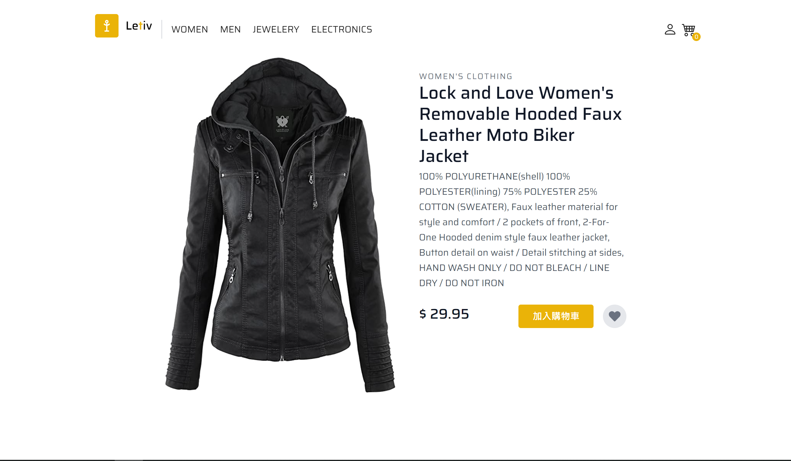
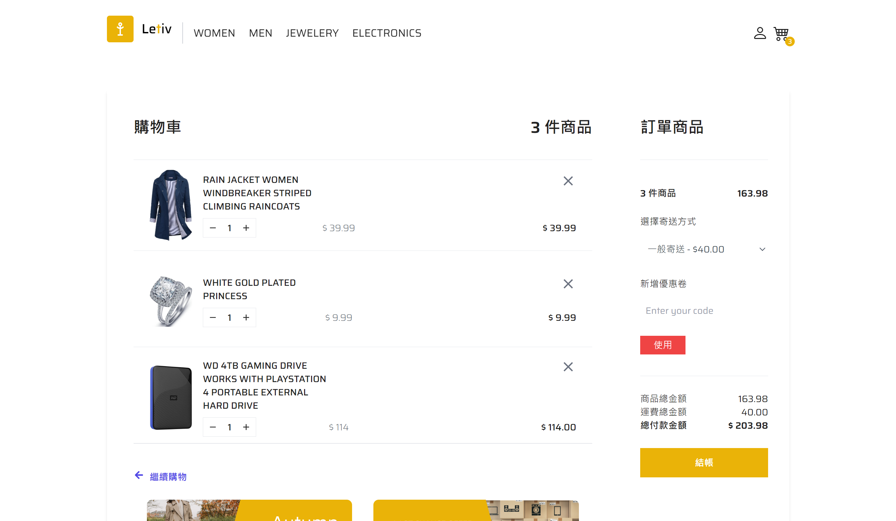

# Letiv | 電子商務網站UI

使用 React JS，TailsindCSS 以及 Fake Store API 來獲取產品數據的響應式電子商務網站 UI。

A responsive ecommerce App UI using React JS and TailsindCSS  with Using Fake Store API to Get Products Data.


## 試用 Demo

請點擊連結 [https://letiv.vercel.app/](https://letiv.vercel.app/) 試用 demo


## 畫面截圖


| | | 
|:-------------------------:|:-------------------------:|
| |   |
| |   | 


## 安裝

以下將會引導你如何安裝此專案到你的電腦上。

Node.js 版本建議為：`v20.11.1` 以上...

### 取得專案

```bash
git clone https://github.com/zoewang7512/Letiv.git
```

### 移動到專案內

```bash
cd Letiv
```

### 安裝套件

```bash
npm install
```

### 運行專案

```bash
npm start
```
### 發佈專案

```bash
npm run deploy
```

## 專案技術

- Node.js v20.11.1
- react v18.3.1
- react-router-dom v6.24.1
- react-icons v5.2.1
- tailwindcss v3.4.4

